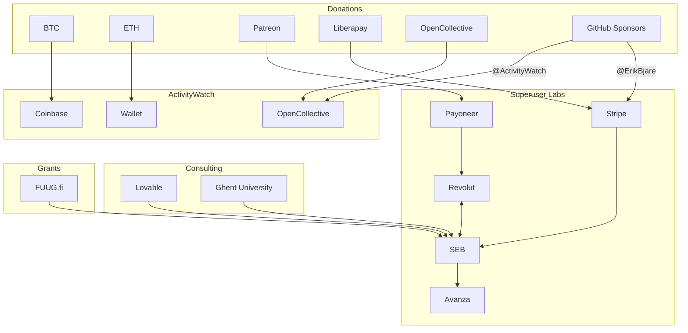

Superuser Labs Meta Repository
==============================

This repository contains key information about Superuser Labs, along with documents and other public resources.

## About the company

Superuser Labs was originally the name for the group of people who were involved with the early development of ActivityWatch and Thankful around 2017-2019. 
As work on Thankful ceased and ActivityWatch became a community-led operation, most contributors moved on except brothers Erik and Johan Bjäreholt.

The company was formally founded in 2022 as a Swedish AB ("Aktiebolag"). 
Company formation happened in response to Erik getting ActivityWatch-related consulting offers, and there being a need to structure donations into an entity. 

A foundation was considered since there is very little financial interest, but was postponed indefinitely due to the operational cost and overhead, as well as the one-way nature of such a decision and there likely being a need for a two-tier structure anyway.

### Mission

Superuser Labs' mission is to research and develop open-source software that empowers people.

### Key information

The company:

 - Is registered in Sweden.
 - Has a Swedish Company registration number ("organisationsnummer") 559388-1773.
 - Has a VAT number ("momsregistreringsnummer") SE559388177301.
 - Has a DUNS number: 351299922.
 - Has bank accounts with SEB and Revolut.
 - Has two (as of yet unpaid) employees, Erik Bjäreholt and Johan Bjäreholt.
 - Has a board of directors consisting of Erik Bjäreholt and Johan Bjäreholt.

## Finances

It is still early and the company is still finding its footing, but we aim to be transparent about our operations and will update this document as we grow.

We have completed our first fiscal year (2023) and are in the process of finalizing the annual report.

### Income

The company's income comes from a mix of consulting work, donations, and grants. 

Below is a high-level overview of the company's income sources, serving to clarify the relationships between the company and related entities.

### Expenses 

The company's expenses are primarily spent on hardware, cloud services, and other operational costs.

We intend to scale up our development capacity by hiring more developers, but as of now, the company has no employees and no salaries are paid out, apart from small grants to part-time developers.

The company does not pay bug bounties for ActivityWatch, as those are paid out from OpenCollective (a separate legal entity).

## Transparency

We aim to have a high level of transparency and openness in our operations, and this repository is intended to be the starting point for all public information about Superuser Labs.

## Links

Website: [superuserlabs.com](https://superuserlabs.com)
GitHub: [github.com/superuserlabs](https://github.com/superuserlabs)
Twitter: [@superusrlabs](https://twitter.com/superusrlabs)
